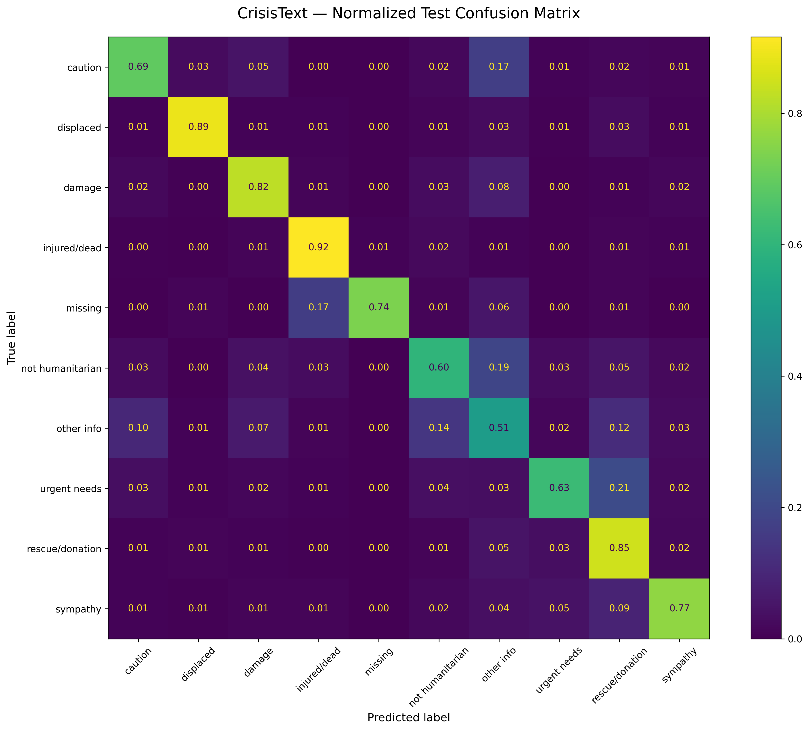
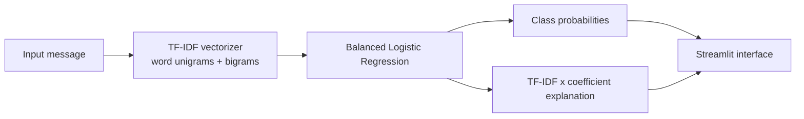

# CrisisText

Explainable humanitarian crisis message triage using TF-IDF word unigram/bigram features, class-balanced Logistic Regression, and Streamlit.


## Problem

During fast-moving disasters, responders and analysts may face a flood of short social-media messages. Manual triage is slow, inconsistent, and difficult to scale. CrisisText classifies humanitarian messages into operational categories and surfaces coefficient-based explanations so a reviewer can see which terms supported or opposed the prediction.

## Run Locally

CrisisText is released as a local Streamlit app with a verified Docker runtime. No hosted Hugging Face demo is linked in this README because the Docker Space deployment was not completed.

```powershell
pip install -r requirements.txt
streamlit run app.py
```



## Key Results

Final held-out test metrics from `reports/final_test_metrics.json`:

| Metric | Value |
| --- | ---: |
| Accuracy | 0.7515 |
| Macro-F1 | 0.7282 |
| Weighted-F1 | 0.7501 |
| Missing/found people recall | 0.7361 |
| Requests/urgent needs recall | 0.6257 |

The test set was evaluated once after validation-driven model selection.

## Supported Classes

- Caution and Advice
- Displaced People and Evacuations
- Infrastructure and Utility Damage
- Injured or Dead People
- Missing or Found People
- Not Humanitarian
- Other Relevant Information
- Requests or Urgent Needs
- Rescue, Volunteering or Donation Effort
- Sympathy and Support

## Dataset

CrisisText uses `QCRI/HumAID-all` from Hugging Face. The local project artifacts use these split sizes:

| Split | Rows |
| --- | ---: |
| Train | 53,531 |
| Validation | 7,793 |
| Test | 15,160 |

Raw and processed parquet files are not committed. Regenerate them with `notebooks/01_data_setup.ipynb`. The upstream dataset license and citation remain governed by the official dataset card.

## Method

The selected model is E11: raw tweet text, word unigram/bigram `TfidfVectorizer`, and class-balanced `LogisticRegression`.

Configuration:

- `ngram_range=(1, 2)`
- `min_df=2`
- `sublinear_tf=True`
- `lowercase=True`
- `stop_words=None`
- `C=2.0`
- `solver="liblinear"`
- `max_iter=1000`
- `random_state=42`

Macro-F1 was the primary validation metric because label imbalance is substantial and minority operational classes matter.

## Experiment Journey

The project preserves E0-E16 in `notebooks/02_model_training.ipynb`.

- E0 established a most-frequent dummy baseline.
- E1-E3 compared count and TF-IDF Naive Bayes baselines.
- E4-E6 showed Logistic Regression improvements, especially with class balancing and word bigrams.
- E7-E9 tested LinearSVC and character features.
- E10 tuned Logistic Regression `C`.
- E11 selected raw text with TF-IDF lowercasing.
- E12-E16 tested stopwords, `min_df`, `sublinear_tf`, and `max_df`.

E11 and E16 matched on validation metrics; E16 removed no features and changed no predictions, so E11 remains the simpler selected configuration.

## Architecture



## Explainability

Global explanations come from class-specific positive and negative coefficients. Local explanations multiply a message feature's TF-IDF value by the selected class coefficient. These values explain the model's linear score; they are not probabilities and should not be read as causal evidence.

## Error Analysis

The main error themes are:

- `other_relevant_information` ambiguity because it is broad and heterogeneous.
- Urgent-needs versus donation confusion when messages mix requests and offers of aid.
- Missing-person versus injured/dead overlap in casualty-related wording.
- Event-specific lexical shortcuts such as place names or disaster-specific terms.
- Label noise and likely mislabeled examples surfaced by manual audit.

## Ethical Considerations

CrisisText is decision support for analysts and responders. It is not emergency dispatch, a replacement for local authorities, or a guarantee of message priority. Keep a human reviewer in the loop, monitor new-event drift, and treat confidence as model uncertainty rather than operational certainty.

## Repository Structure

```text
crisis-text-triage/
  app.py
  assets/
  checkpoints/
  data/
  deploy/
  docs/
  models/
  notebooks/
  reports/
  scripts/
  src/
  tests/
```

## Installation

```powershell
python -m venv .venv
.\.venv\Scripts\Activate.ps1
pip install -r requirements.txt
```

For development:

```powershell
pip install -r requirements-dev.txt
```

## Local Usage

```powershell
python scripts/smoke_test_inference.py
```

```python
from src.inference import load_model, predict_message

model = load_model()
result = predict_message("Families urgently need clean water and food.", model)
print(result["display_name"], result["confidence"])
```

## Running Streamlit

```powershell
streamlit run app.py
```

## Notebook Guide

- `notebooks/01_data_setup.ipynb`: dataset loading, audit, and minimal preprocessing.
- `notebooks/02_model_training.ipynb`: E0-E16 validation experiments and final train+validation retraining.
- `notebooks/03_evaluation_explainability.ipynb`: validation error analysis, explainability, manual audit, and one-time test evaluation.
- `notebooks/archive/01_data_setup_original.ipynb`: preserved original research notebook source.

## Reproducing Training

1. Run `notebooks/01_data_setup.ipynb` and enable local parquet saving if needed.
2. Run `notebooks/02_model_training.ipynb`.
3. Run `notebooks/03_evaluation_explainability.ipynb` only after model selection is complete.

## Running Tests

```powershell
python -m compileall app.py src
python scripts/validate_project.py
python scripts/smoke_test_inference.py
pytest -q
ruff check .
```

## Docker

The Docker image was built and smoke-tested locally.

```powershell
docker build -t crisis-text-triage:local -f deploy/huggingface/Dockerfile .
docker run --rm -p 7860:7860 crisis-text-triage:local
```

Then open:

```text
http://127.0.0.1:7860
```

The container health endpoint was verified at:

```text
http://127.0.0.1:7860/_stcore/health
```

## Hugging Face Space Status

This release intentionally does not include a live Hugging Face Space. Hugging Face returned `402 Payment Required` when creating the Docker Space because Docker Spaces on free `cpu-basic` require a PRO subscription. The repository keeps the Docker Space packaging in `deploy/huggingface/` for reproducibility, but no unverified live-demo badge or Space URL is published.

## Future Work

- Transformer comparison
- Event-held-out evaluation
- Probability calibration
- Multilingual support
- Priority scoring
- Duplicate detection
- API endpoint

## Author

Celal Ibrahimli

- Hugging Face: https://huggingface.co/celalibr
- GitHub: https://github.com/celalthedon
